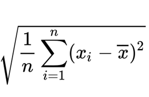

# TP2 : Gestion des Joueurs d'une Équipe de Football
## À faire en équipe de deux

## Sommaire
Un coach souhaite gérer les performances des joueurs de son équipe. Il a besoin de stocker les informations suivantes :
- Une liste noms (noms et prénoms des joueurs),
- Une liste postes (poste de chaque joueur : Gardien, Défenseur, Milieu, Attaquant),
- Une liste vitesse (vitesse en km/h),
- Une liste passes (nombre de passes réussies),
- Une liste tirs (nombre de tirs cadrés),
- Une liste buts (nombre de buts marqués). 

1) **Saisie des informations des joueurs (10 points)**  
Implémenter une fonction nommée peupler(ma_chaine)  
La fonction prend en paramètre une chaine de caractère ma_chaine et retourne les 6 listes sus-mentionnées.  
La fonction doit décomposer ma_chaine en nom, poste, vitesse, nombre de passes, nombre de tirs et buts et les ajouter à la fin des listes:
   - noms
   - postes
   - vitesse
   - passes
   - tirs
   - buts

En dehors de la fonction, vous faites appel à la fonction peupler pour saisir les informations de 5 joueurs valides et stockez-les dans les listes correspondantes. Chaque joueur est saisi sous forme d'une chaîne de caractères séparée par un ou des espaces. Les seules chaines qu’on accepte sont les chaines qui contiennent les mots Gardien, Défenseur, Milieu, Attaquant. Faute de quoi vous demandez de ressaisir la chaine

>Exemples de message :  
Donnez les informations du joueur **1** :  
Lionel Messi Milieu 32 45 10 8  
Donnez les informations du joueur **2** :  
Mustapha Boushaba attaquant 32 50 100 15  

*Remarque : le chiffre en gras doit s’incrémenter en fonction d’une chaine acceptée.* 


2) **Calcul des performances (5 points)**  
Implémenter une fonction nommée efficacite(vitesse, nb_passes, nb_tirs, nb_buts).  
La fonction prend en argument dans cet ordre 4 nombres vitesse (réel), nombre de passes (entier), le nombre de tirs (entier) et le nombre des buts (entier) puis retourne l’efficacité du joueur.  
L’efficacité est calculée selon la formule suivante :
Efficacité = 30% * (vitesse) + 40% * (passes) + 20% * (tirs) + 10% * (buts)


3) **Affichage des informations (10 points)**  
Implémenter une procédure affichage_informations(noms, postes, vitesse, passes, tirs, buts)  
La fonction prend en argument les 6 listes dans cet ordre noms, postes, vitesse, passes, tirs et buts et qui affiche les informations d’un joueur ainsi que son efficacité.  
Pour chaque joueur, votre affichage doit ressembler comme suit (Vous devez respecter le format d'affichage. Avant Nom une seule ligne en pointillé doit apparaitre. Après Efficacité, une seule ligne en pointillé doit apparaitre).  
```
    ----------------------------------------- Liste des joueurs ----------------------------------------  
    -----------------------------------  
    Nom : Lionel Messi  
    Poste : Milieu  
    Vitesse : 32 km/h
    Passes : 45  
    Tirs cadrés : 10  
    Buts : 8  
    Efficacité : 38.9  
    -----------------------------------  
    Nom : Mustapha Boushaba  
    Poste : Attaquant  
    Vitesse : 32 km/h  
    Passes : 50  
    Tirs cadrés : 100  
    Buts : 15  
    Efficacité : 51.1  
    -----------------------------------
```
*Remarque : Pour le joueur Mustapha Boushaba, on remarque que le poste a été saisi en minuscule (attaquant) mais dans l’affichage, juste la première lettre a été mise en majuscule (Attaquant). Vous devez faire de même pour tous les postes des joueurs.*


4) **Trouver le(s) meilleur(s) joueur(s) (10 points)**  
Implémenter une procédure meilleurs_joueurs(noms, postes, vitesse, passes, tirs, buts)  
La procédure prend en argument les 6 listes dans le même ordre habituel noms, postes, vitesse, passes, tirs et buts.  
La procédure ne retourne rien. Elle doit juste afficher le nom ou les noms des joueurs ayant l’efficacité la plus élevée.


5) **Moyenne des performances de l'équipe (5 points)**  
Implémenter une fonction moyenne_efficacites(vitesse, passes, tirs, buts)  
La fonction calcule et retourne la moyenne des efficacités de tous les joueurs (moyenne de l’équipe). Votre fonction doit prendre en paramètre les listes dans cet ordre vitesse, passes, tirs, buts. 


6) **Écart-type des performances (10 points)**  
Implémenter une procédure ecart_type(vitesse, passes, tirs, buts)  
La procédure calcule et affiche l’écart-type des efficacités des joueurs de l’équipe. La procédure prend en argument et dans cet ordre les listes suivantes : vitesse, passes, tirs, buts.

   Pour le calcul de l’écart-type, vous devez absolument implémenter la formule suivante.

>

   Où *xi* est l’efficacité du joueur i, *x̅* est la moyenne de l’efficacité de l’équipe, *n* est le nombre de joueurs dans l’équipe (le *n* doit être calculé automatiquement).

7) **Joueurs performants et non performants (10 points)**  
Implémenter une fonction division(seuil, noms, vitesse, passes, tirs, buts)  
La fonction prend en argument et dans cet ordre :
   -	un nombre réel qui représente un seuil de performance/efficacité 
   -	les 5 listes dans cet ordre noms, vitesse, passes, tirs et buts
   puis retourne deux listes contenant les noms des joueurs. Une liste de ceux dont l’efficacité est supérieure ou égale au seuil de l’argument. Puis une autre de ceux qui sont inférieurs au seuil. En dehors de la fonction, afficher ces deux listes. Vous devez évidemment écrire lors de l’affichage un message avant chaque liste pour dire de quoi il s’agit.


8) **Trier les joueurs par efficacité (5 points)**  
Implémenter une procédure trier_efficacite(noms, postes, vitesse, passes, tirs, buts)  
La procédure prend en argument les 6 listes dans cet ordre noms, postes, vitesse, passes, tirs et buts.  
Puis trier les joueurs par ordre d’efficacité décroissant et les afficher. 
Votre affichage doit ressembler à ceci en fonction des joueurs saisis (Les chiffres en préfixe doivent s’afficher aussi pour dire l’ordre) :
```
1. Mustapha Boushaba - Efficacité : 51.1
2. Lionel Messi – Efficacité : 38.9
etc…
```

## Consignes supplémentaires et remarques:
1.	Toutes les fonctions doivent être en haut du programme.
2.	Les appels et les traitements en bas du programme.
3.	Ajouter suffisamment de commentaires
4.	Identifiez-vous correctement dans l’entête du programme
5.	Respecter les consignes, les noms des fonctions, les noms des procédures et les noms des listes. Faute de quoi vous perdez des points.
6.	Faites les appels et les affichages pour montrer que la fonction/procédure marche bien
7.	Vous serez noté, en plus des résultats attendus, sur la présence des bogues.
8.	Une vérification accrue de plagiat et de l’utilisation d’IA seront effectuées


